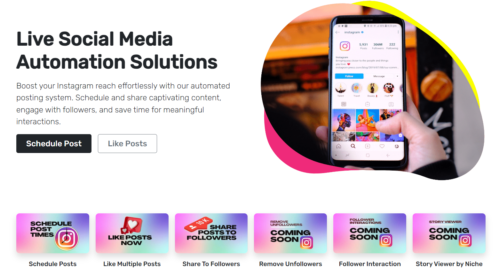

# Instagram Automation Project
Automate various Instagram actions using Python and Selenium.

  

## Overview
This project aims to provide a set of tools and functionalities to automate Instagram actions using Python and the Selenium web automation framework. The project includes features like scheduling posts, liking multiple posts, sharing posts with followers, downloading followers' usernames, and more. The automation is performed using the Chrome WebDriver, enabling seamless interaction with the Instagram web interface.

## Instagram Automation Features 📲

Explore the powerful Instagram automation features that are integrated into this project:

* **Scheduled Posts** 📅: Schedule Instagram posts to be published at a specific time.

* **Multiple Likes** 👍: Automatically like a specified number of posts from a user's account.

* **Share to Followers** 📢: Share a post with a custom message to a user's followers.

* **Download Followers** 📥: Download and save followers' usernames for future interactions.

* **Remove Unfollowers** 🗑️: (Coming Soon) Remove users who unfollowed you from the followers' list.

* **Follower Interactions** 👥: (Coming Soon) Interact with followers through likes, comments, and more.

* **Story Viewer** 📖: (Coming Soon) View Instagram stories of the specified users.

## Installation
1. Clone the repository:
   git clone https://github.com/yourusername/instagram-automation.git
   cd instagram-automation

